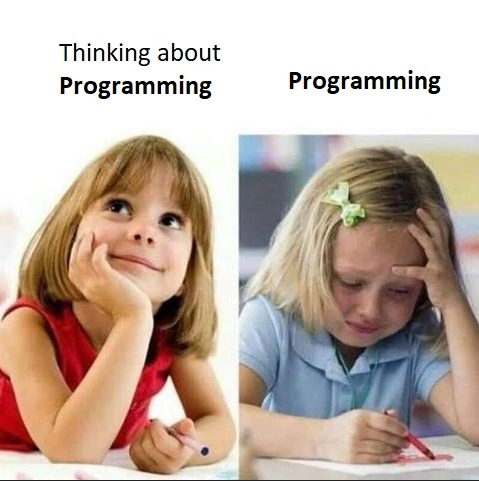

  

<h1 align="center">Hi 👋, I'm Wallyson Galvão</h1>
<h3 align="center">A fullstack developer from Brazil</h3>

  ReactJS | React Native | Node.js

- 🔭 I’m currently working on **[Banco do Brasil App](https://www.bb.com.br/pbb/pagina-inicial)** with React Native.
- 🌱 I’m currently learning **Docker and Cloud (CGP, Azure and AWS)**.
- 📝 I'm always learning **Clean Code, SOLID and Patterns**.

